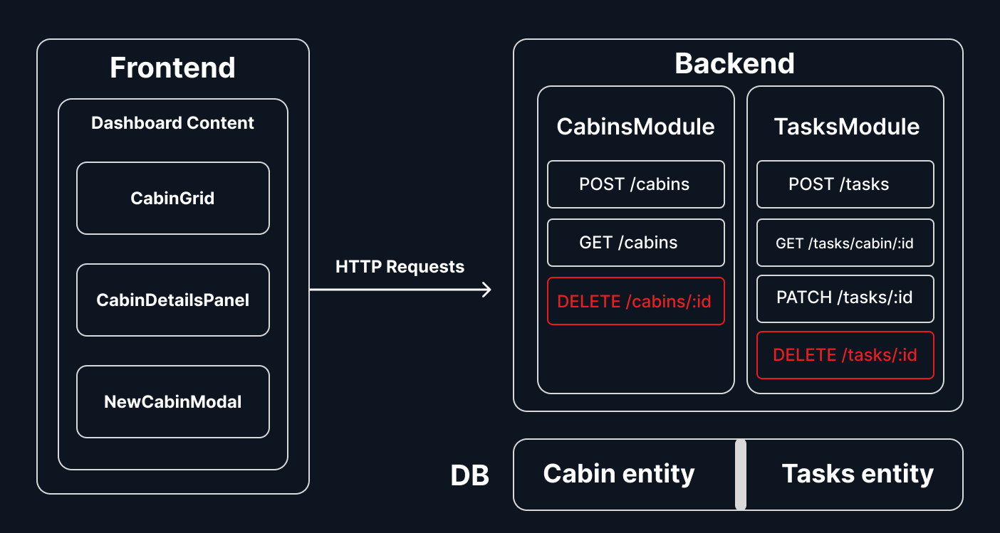

# CabinCare Manager
a simple, full-stack application for managing small properties (cabins) and logging their maintenance needs.
- Create cabins (name, location, description) Cabins Cannot updated the manager only can create and delete cabins
- Log maintenance tasks per cabin (description, priority, status) Tasks can be updated (status only) and deleted.
- See a dashboard with total cabins and pending High/Medium priority tasks

## Tech Stack
- **Frontend**: React + TypeScript + Vite + Tailwind + shadcn/ui
- **Backend**: NestJS + TypeORM
- **Database**: PostgreSQL
- **Infra**: Docker & Docker Compose

## Quick Start

### Prerequisites
- Docker + Docker Compose (for running the backend and db)
- Node.js (for running the frontend)

### 1. Backend + Database

From the project root:

```bash
./setup.sh
```
**This will:**
- Build and start the Postgres + NestJS API containers
- API will be available at: ``http://localhost:3000``

### 2. Frontend

**In a separate terminal run:**
```bash
cd frontend
npm install
npm run dev
```

Then open the printed Vite URL (http://localhost:5173).

## API Documentation (Backend)

**Swagger API Doc: http://localhost:3000/swagger/**

**Base URL: ``http://localhost:3000``**

### Cabins

``POST /cabins``

Create a new cabin.

**Body:**
```json
{
  "name": "Cabin 101",
  "location": "Campus 1",
  "description": "Near reception"
}
```

``GET /cabins``

Returns all cabins with their tasks.

**Response example**
```json
[
  {
    "id": 1,
    "name": "Cabin 101",
    "location": "Campus 1",
    "description": "Near reception",
    "tasks": [
      {
        "id": 2,
        "description": "Fix water leak",
        "priority": "HIGH",
        "status": "PENDING",
        "cabinId": 1
      }
    ]
  }
]
```

``DELETE /cabins/:id``

Delete a cabin

### Tasks
``POST /tasks``

Create a new maintenance task for a cabin.

**Body:**
```json
{
  "description": "Fix water leak",
  "priority": "HIGH",
  "status": "PENDING",
  "cabinId": 1
}
```

``GET /tasks/cabin/:id``

Get all tasks for a single cabin.

**Response example**
```json
[
  {
    "id": 2,
    "description": "Fix water leak",
    "priority": "HIGH",
    "status": "PENDING",
    "cabinId": 4
  },
  {
    "id": 3,
    "description": "Fix roof",
    "priority": "HIGH",
    "status": "PENDING",
    "cabinId": 4
  }
]
```

``PATCH /tasks/:id``

Update a task status 

```json
{
    "status": "IN_PROGRESS"
}
```

``DELETE /tasks/:id``

Delete a task

## Frontend Features

### Dashboard:

- Shows total number of cabins

- Shows total number of pending high/medium priority tasks

- Cabin grid:

- Card per cabin, showing name, location and counts of pending High/Medium tasks

### Cabin details panel:

- Slide-in panel from the right when a cabin is clicked

- Shows full description and all tasks

- Allows creating a new task with description, priority, and status

- Allows updating task status (Pending / In Progress / Complete)

- Allows deleting tasks (with confirmation dialog + toast)

### Create cabin modal:

- Button "New Cabin" opens a modal

- Validates required fields (name, location)

- On success, updates the dashboard immediately

### Dark mode:

- Theme toggling using a custom ThemeProvider

- Uses Tailwind’s dark class and shadcn theme tokens

## Architecture



## Design Decisions

### Summary counts on the frontend:

- For simplicity and clarity, the dashboard summary (total High/Medium pending tasks) is computed on the frontend from the /cabins response. This avoids extra API endpoints and keeps the data flow simple, while still reflecting real-time task updates.

### Task management UX:

- Task status can be changed inline via a dropdown, and destructive actions like delete are protected with a confirmation dialog (AlertDialog) and followed by a toast (Sonner), which provides a smoother admin-dashboard experience.